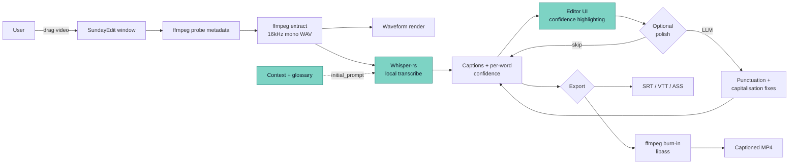

# SundayEdit — Architecture

Last updated: 2026-05-28

## High-level flow



Killer-feature cells highlighted: ASR (with context priming) and Editor (with confidence highlighting).

## Data model

```mermaid
erDiagram
  Project ||--|{ Caption        : "ordered list"
  Project ||--o{ Speaker        : "diarization"
  Project ||--o{ GlossaryTerm   : "context"
  Project ||--o| Style          : "default style"
  Project ||--o{ HistoryEntry   : "undo stack"

  Caption ||--|{ Word           : "ordered words"
  Caption }o--o| Speaker        : "attributed"
  Caption }o--o| Style          : "override"
  Caption }o--o| GlossaryAutoCorrection : "applied"

  Word }o--o{ AlternateRead     : "ASR alternates"
```

### Project

| Field                         | Type    | Notes                                          |
| ----------------------------- | ------- | ---------------------------------------------- |
| `id`                          | UUIDv7  |                                                |
| `name`                        | string  | derived from video filename initially          |
| `video_path`                  | string  | absolute path                                  |
| `video_content_hash`          | string  | sha-256, for relink on path break              |
| `video_duration_ms`           | i64     |                                                |
| `video_width`, `video_height` | i32     |                                                |
| `video_fps`                   | f32     |                                                |
| `audio_wav_path`              | string  | cached extracted audio                         |
| `language`                    | string  | ISO 639-1; `auto` for autodetect               |
| `default_style_id`            | UUIDv7? |                                                |
| `context_description`         | string? | freeform — used as Whisper initial_prompt seed |
| `created_at`, `updated_at`    | i64     | unix ms                                        |

### Caption (one displayed subtitle line)

| Field                | Type    | Notes                                        |
| -------------------- | ------- | -------------------------------------------- |
| `id`                 | UUIDv7  |                                              |
| `project_id`         | FK      |                                              |
| `start_ms`, `end_ms` | i64     | invariant: `start < end`                     |
| `text`               | string  | derived: `words.map(w=>w.text).join(" ")`    |
| `speaker_id`         | UUIDv7? | when diarization is on                       |
| `style_id`           | UUIDv7? | per-caption override                         |
| `notes`              | string? | editor note                                  |
| `ai_generated`       | bool    | from ASR vs hand-typed                       |
| `last_edited_at`     | i64     |                                              |
| **Invariants**       |         | Captions never overlap; sorted by `start_ms` |

### Word

| Field                | Type              | Notes                                                |
| -------------------- | ----------------- | ---------------------------------------------------- |
| `text`               | string            |                                                      |
| `start_ms`, `end_ms` | i64               | derived from Whisper                                 |
| `confidence`         | f32               | 0..100 normalized                                    |
| `edited`             | bool              | user has changed this from ASR                       |
| `locked`             | bool              | user has confirmed (don't flag as uncertain anymore) |
| `alternates`         | `AlternateRead[]` | top-3 Whisper alternates with their probs            |

### GlossaryTerm

| Field                | Type       | Notes                                    |
| -------------------- | ---------- | ---------------------------------------- |
| `id`                 | UUIDv7     |                                          |
| `project_id`         | FK         |                                          |
| `term`               | string     | canonical form                           |
| `aliases`            | `string[]` | misrecognitions auto-corrected to `term` |
| `definition`         | string?    | hover-display                            |
| `pronunciation_hint` | string?    | for Whisper context                      |

### Style

| Field                                                               | Type             | Notes                                 |
| ------------------------------------------------------------------- | ---------------- | ------------------------------------- |
| `id`                                                                | UUIDv7           |                                       |
| `font_family`, `font_size`, `font_weight`, `italic`                 |                  |                                       |
| `color_fg`, `outline_color`, `outline_width`                        |                  |                                       |
| `shadow_color`, `shadow_offset_x`, `shadow_offset_y`, `shadow_blur` |                  |                                       |
| `background_color`, `background_padding`, `background_radius`       |                  |                                       |
| `align_h`, `align_v`                                                |                  | left/center/right × top/middle/bottom |
| `anchor`                                                            | string           | 9-grid position                       |
| `max_width_pct`                                                     | f32              |                                       |
| `line_spacing`, `letter_spacing`                                    |                  |                                       |
| `animation`                                                         | `AnimationSpec?` | fade, slide, karaoke, popup, none     |

## Confidence tiers — the killer feature

Per-word confidence comes from the ASR model (log-probability of the chosen token, normalized to 0–100). The renderer assigns each word to one of four tiers:

| Tier         | Range  | Visual                         | Meaning                 |
| ------------ | ------ | ------------------------------ | ----------------------- |
| 1 (high)     | 85–100 | No highlight                   | The 92% you don't touch |
| 2 (medium)   | 70–84  | Subtle amber background        | Skimmable               |
| 3 (low)      | 50–69  | Clear amber + dotted underline | Demands a glance        |
| 4 (very low) | 0–49   | Red-orange + wavy underline    | Demands attention       |

**Underlines are an accessibility fallback** — color alone isn't enough. Colorblind users still see SOMETHING.

Tier boundaries are NOT defaults pulled from thin air — they're calibrated against real transcripts. See `docs/CALIBRATION.md` (to be filled as we ship data).

## Operations (pure functions over Project state)

| Function            | Signature                                            | Notes                                   |
| ------------------- | ---------------------------------------------------- | --------------------------------------- |
| `splitCaption`      | `(project, caption_id, at_word_index)`               | one caption → two                       |
| `mergeCaptions`     | `(project, [caption_ids])`                           | adjacent only                           |
| `shiftAllCaptions`  | `(project, offset_ms)`                               | bulk nudge                              |
| `editWord`          | `(project, caption_id, word_index, new_text)`        | marks `edited`                          |
| `retimeWord`        | `(project, caption_id, word_index, start, end)`      | manual timing                           |
| `lockWord`          | `(project, caption_id, word_index)`                  | removes confidence highlight            |
| `acceptAlternate`   | `(project, caption_id, word_index, alternate_index)` | from tooltip                            |
| `regenerateCaption` | `(project, caption_id)`                              | re-run ASR on this caption's time range |

All operations validate invariants and return a new `Project` state. Undo is trivial: keep the previous state. History is capped (default 100).

## Project file format

`.sundayedit` files are SQLite databases — one file per project. Same engine as the in-memory data model; just persisted. This makes loading instant and avoids JSON-parse cost for projects with 5000+ captions.

Caveat for path-stability: if the user moves their video file, SundayEdit detects the missing path on open, hashes candidate files in common locations, and offers to relink. Same pattern as SundayStage's MediaAsset relink (Phase 7.2 there).

## Phase status (May 2026)

Quality infra (Phase 0.2): ESLint/Prettier, Vitest, Playwright e2e, husky +
commitlint, and a PR `ci.yml` gate (web + rust) — all wired.

- [x] Phase 0 — Scaffold + design tokens + confidence color scale + quality infra (0.2)
- [x] Phase 1.1 — Video import: ffprobe metadata, format validation, content-hash relink, `.sundayedit` SQLite file format
- [x] Phase 1.2 — Audio extraction command + multi-zoom waveform peaks + Canvas waveform component
- [x] Phase 1.3 — Full timeline: windowed waveform + ruler + virtualized caption track, drag-move/resize with snap-to-edges/playhead (S toggles), J/K/L shuttle transport, ←/→ caption step, ⌘+scroll zoom-to-cursor. Pending: real `<video>` attached to the playhead clock.
- [x] Phase 2.1 — ASR abstraction, Whisper model registry, feature-gated `LocalWhisperProvider`, captionizer, **+ first-run model download** (`asr_download_model`, atomic + progress + cancel)
- [x] Phase 2.2 — Cloud: response normalization (OpenAI/AssemblyAI/Deepgram) + **provider picker, cost preview, upload-consent UX** + **API keys in the OS keychain** (`keyring`) + **OpenAI live upload** + **oversized-upload preflight** (per-provider byte caps surfaced in the picker; OpenAI's 25 MB limit fails early with a clear "use local Whisper / trim" message instead of an opaque API error). Pending: AssemblyAI/Deepgram live calls; chunking large files for OpenAI is a future option.
- [x] Phase 2.3 — Per-word confidence normalization + **calibration harness** (`cargo run --example calibrate`). Curve still uses the v1 estimate until real labelled data is fed in.
- [x] Phase 3.1 — Caption data model + operations
- [x] Phase 3.2 — Editor UX: inline word edit, alternate-picker popover, lock, undo/redo, focus mode
- [x] Phase 3.3 — Confidence highlighting (killer #1): 4 tiers, Tab/Shift-Tab review, threshold, progress
- [x] Phase 3.4 — Context priming + glossary (killer #2): priming + auto-correction + **ContextPanel CRUD UI** + **AI term-suggestion from transcript** (mode 3) + **reference-document extraction** (mode 4: `.txt`/`.md`/`.docx` → LLM term proposals, runnable before transcription; `services::document` does the dependency-free extraction, DOCX via the `zip` crate we already ship). PDF deliberately deferred (no reliable dependency-free parser).
- [x] Phase 4 — AI polish (4.1, substance-guarded), diarization (4.2, sidecar-gated), smart suggestions (4.3, propose-and-approve)
- [x] Phase 5.1/5.3 — Style model + bundled presets + `styleToCss` WYSIWYG (mirrors ASS burn-in)
- [x] Phase 5.2 — Visual style editor: preset gallery, live preview, font/colour/outline/9-grid, safe-area guide
- [x] Phase 6.1 — Export SRT / VTT / ASS / TXT / **JSON** / **DOCX** + **save-to-file** (`save_export`). Pending: SCC/CEA-608 (deliberately deferred).
- [x] Phase 6.2 — Burn-in via libass: pure ffmpeg-arg builder (HW encoder per platform), ASS sidecar, `render()`
- [x] Phase 6.3 — Platform export presets + pre-render validation
- [x] Phase 7 — translation (7.1), filler/silence removal with ripple (7.2), find & replace (7.3)
- [~] Phase 8 — Sunday-link: **deep-link import + caption hand-back done** (inbound `sundayedit://import?…` → parser + renderer seeding of language/context/glossary; outbound `<returnTo>://captions?path=…` after an SRT/VTT save, see `docs/integration.md`). Pending native verification (OS scheme round-trip) + the optional Sunday **Account** (cloud) integration.
- [~] Phase 9 — Onboarding (9.1) done; **distribution pipeline (9.2) live** (signed/notarized release on `v*` tag, ffmpeg sidecars, auto-update); **full i18n done** (all 7 locales carry the complete catalog). Pending: landing site (9.3).

**Not yet wired end-to-end:** there is no in-app "Transcribe" action connecting
model + audio → `asr_transcribe_local` → editor yet (each piece exists; the
glue is native-only so it's untested headless). And nothing has run against a
real video, so WER / `PERFORMANCE.md` / empirical calibration remain open.
